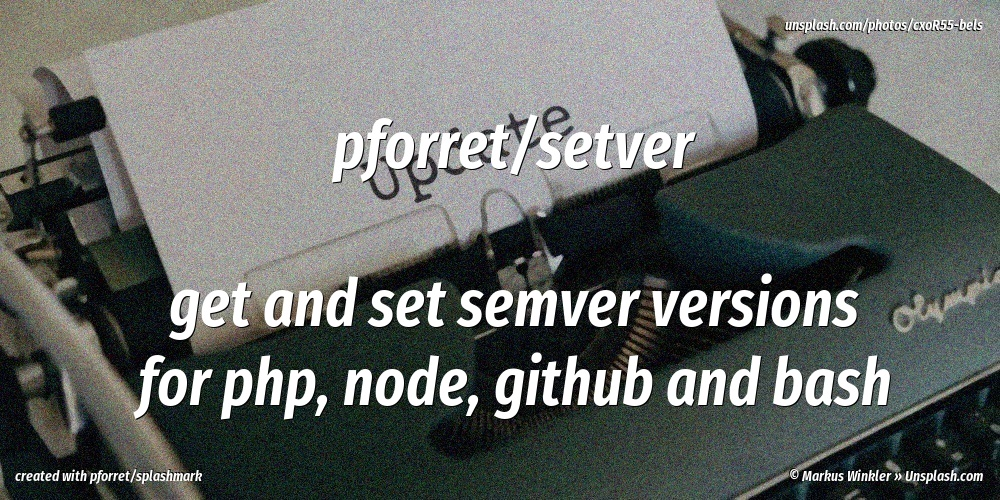

[](https://basher.gitparade.com/package/)

# setver


## TL;DR

to push new changes to Github/Bitbucket

    setver push
    
to bump the version 

    setver new minor
    
## Supported versioning 

* Semantic Versioning helper script, to get and set semver version numbers
* handles versioning for `composer.json`: for PHP, composer packages
* handles versioning for `package.json`: for node, npm
* handles versioning for `.env.example`: for PHP, Python, Ruby
* handles versioning for `VERSION.md`: for bash
* handles versioning by '`git tag`': for Github, Bitbucket

## Usage
```
# setver v1.14.0 - by Peter Forret <peter@forret.com>
# Usage:
    setver [-h] [-v] [-s] [get/check/push/auto/skip/set/new/history/changelog] [version]
    -h: extended help
    -v: verbose mode (more output to stderr)
    -s: add [skip_ci] flag to
    get      : get current version (from git tag and composer) -- can be used in scripts
    check    : compare versions of git tag and composer
    push     : do a git commit -a and and git push, edit commit message manually
    auto     : like 'push', with automatic commit message
    skip     : like 'auto', and add [skip_ci] to commit message
    set <version>: set current version through git tag and composer
    new major: new major version e.g. 2.5.17 -> 3.0.0
    new minor: new minor version e.g. 2.5.17 -> 2.6.0
    new patch: new patch version e.g. 2.5.17 -> 2.5.18
    history  : show last commits
    changelog: add chapter with latest changes to CHANGELOG.md
```

## Installation

with [basher](https://github.com/basherpm/basher)

    basher install pforret/setver

or the hard way

    # clone this repo
    git clone https://github.com/pforret/setver.git
    # if you want the script to be in your path
    ln -s <cloned_folder>/setver /usr/local/bin/

## Example:

    > setver new patch   
    ✔  version 1.12.0 -> 1.12.1
    ✔  set version in package.json
    ✔  set version in composer.json
    ✔  set version in .env.example
    ✔  set version in VERSION.md
    ✔  commit and push changed files
    ✔  push tags to git@github.com:pforret/setver.git
    ✔  to create a release, go to https://github.com/pforret/setver

## References
* https://semver.org/

		Given a version number MAJOR.MINOR.PATCH, increment the:
		MAJOR version when you make incompatible API changes,
		MINOR version when you add functionality in a backwards compatible manner, and
		PATCH version when you make backwards compatible bug fixes.
