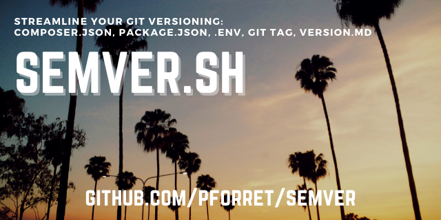

# semver.sh

* Semantic Versioning helper script, to get and set semver version numbers
* handles versioning for composer.json: for PHP, composer packages
* handles versioning for package.json: for node, npm
* handles versioning for .env.example: for PHP, Python, Ruby
* handles versioning for VERSION.md: for bash
* handles versioning by 'git tag': for Github, Bitbucket

## Usage

* `semver.sh get` : get the current version (from git tag/composer/npm)
* `semver.sh check` : compare all versions of git tag, composer, npm, VERSION.md

* `semver.sh push` : short for git commit -a && git push
* `semver.sh auto` : short for git commit -a && git push with auto-generated commit message
* `semver.sh skip-ci` : short for git commit -a && git push (with [skip ci] in commit message)

* `semver.sh changes` : add new chapter in CHANGELOG.md for latest version

* `semver.sh set <version>`: set the current version through git tag and composer
* `semver.sh new major`: add +1 major version e.g. 2.4.17 -> 3.0.0
* `semver.sh new minor`: add +1 minor version e.g. 2.4.17 -> 2.5.0
* `semver.sh new patch`: add +1 patch version e.g. 2.4.17 -> 2.4.18

## Installation

1. `git clone https://github.com/pforret/semver.git`
2. symlink the script to a location in your path: `ln -s <cloned_folder>/semver.sh /usr/local/bin/`

or with [basher](https://github.com/basherpm/basher)

`basher install pforret/semver`

## Example:

    > semver.sh new patch   
    ✔  version 1.12.0 -> 1.12.1
    ✔  set version in package.json
    v1.12.1
    ✔  set version in composer.json
    ✔  set version in .env
    ✔  set version in VERSION.md
    ✔  commit and push changed files
    [master b13f14a] semver.sh: set version to 1.12.1
    To github.com:pforret/semver.git
    ✔  push tags to git@github.com:pforret/semver.git
     * [new tag]         v1.12.1 -> v1.12.1
    ✔  to create a release, go to https://github.com/pforret/semver

## References
* https://semver.org/

		Given a version number MAJOR.MINOR.PATCH, increment the:
		MAJOR version when you make incompatible API changes,
		MINOR version when you add functionality in a backwards compatible manner, and
		PATCH version when you make backwards compatible bug fixes.
